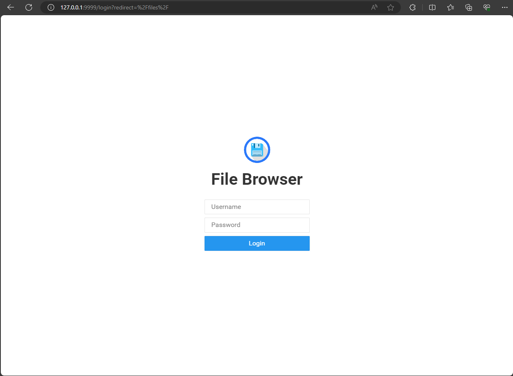

# File BrowserFor Windows

### Install file browser on powershell (administrator)
 ```   shell
    iwr -useb https://raw.githubusercontent.com/filebrowser/get/master/get.ps1 | iex
 ```

### Update filebrowser.json

 ```   json
{
    "port": 9999,
    "baseURL": "",
    "address": "127.0.0.1",
    "log": "stdout",
    "database": "E:\\Coding\\Program Windows\\FileBrowserForWindows\\database\\filebrowser.db",
    "root": "E:\\Coding\\Program Windows\\FileBrowserForWindows\\data",
    "cert": "",
    "key": ""
}
 ```
* port : Mapping port.
* baseURL : BaseURL.
* address : IP Address.
* log : Write logs.
* database : Persistent storage for File browser database.
* root : Maps a local directory to the server directory.
* cert : Certificate.
* key : Key Certificate.

### Deploy file browser
```   shell
   filebrowser -c "E:\Coding\Program Windows\FileBrowserForWindows\filebrowser.json"
 ```

### Open web
##### user : admin
##### password : admin



